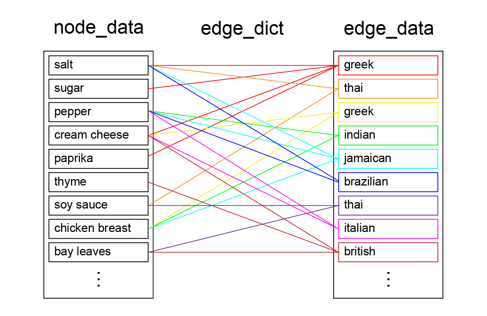
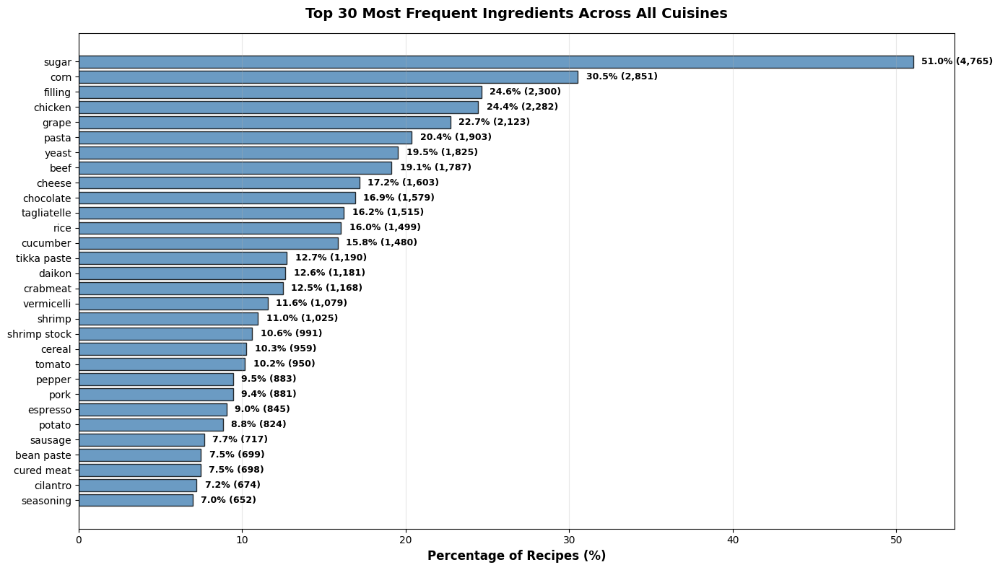
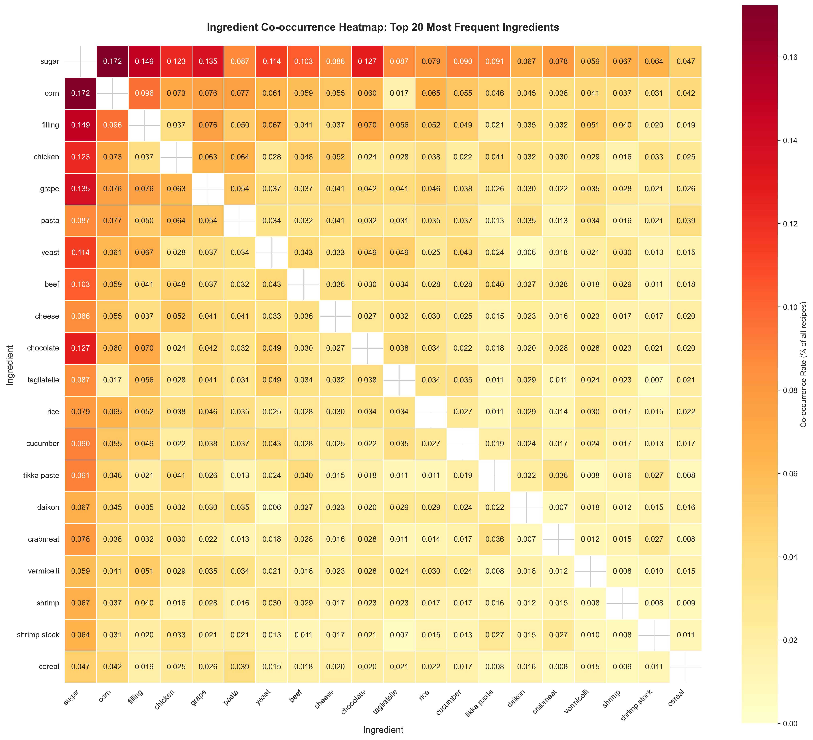
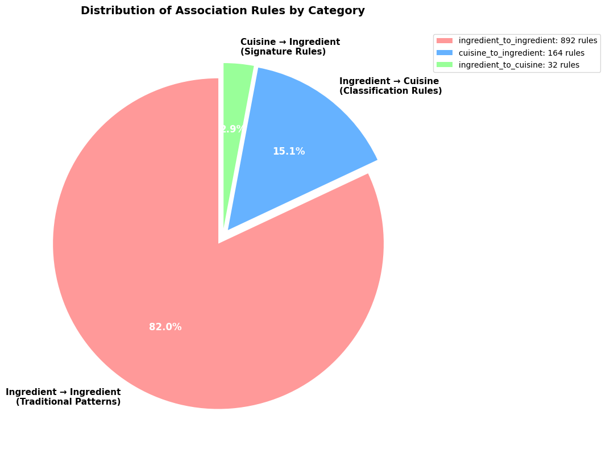
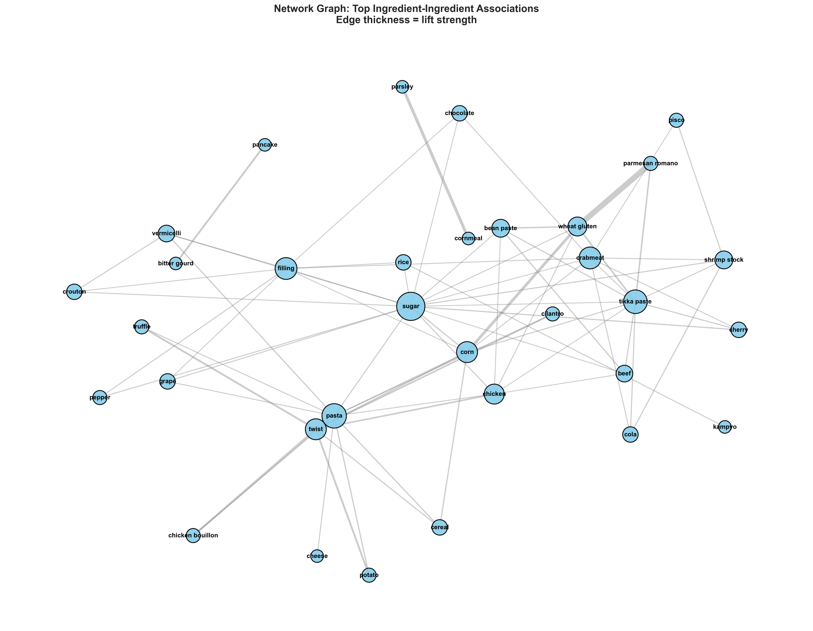

# Project Title: Mining Culinary DNA: High-Dimensional Association Rule Framework for Flavor Profiling
**CSC172 Data Mining and Analysis Final Project** *Mindanao State University - Iligan Institute of Technology* **Student:** Gio Kiefer A. Sanchez, 2022-0025  
**Semester:** AY 2025-2026 Sem 1  

## Abstract
In the domain of recommender systems and inventory management, understanding the latent relationships between item sets is critical for predictive accuracy. This project addresses the challenge of unsupervised pattern discovery within high-sparsity transactional data, specifically applied to the domain of culinary composition. Utilizing the "What's Cooking?" dataset (comprising over 39,000 distinct transactions), this study implements Association Rule Mining to extract statistically significant ingredient dependencies. By employing the Apriori algorithm, the project overcomes the computational complexity inherent in high-dimensional sparse matrices to generate rules based on Support, Confidence, and Lift metrics. The resulting analysis not only identifies robust frequent itemsets but also quantifies the strength of these associations, offering a framework for predictive ingredient recommendation and automated menu generation. Preliminary preprocessing demonstrates a >99% sparsity rate, necessitating optimized one-hot encoding strategies for efficient rule generation. The final deliverable includes a reproducible pipeline for mining, evaluating, and visualizing these complex association networks.

## Table of Contents
- [Abstract](#abstract)
- [1. Introduction](#1-introduction)
  - [1.1 Problem Statement](#11-problem-statement)
  - [1.2 Objectives](#12-objectives)
  - [1.3 Scope and Limitations](#13-scope-and-limitations)
- [2. Dataset Description](#2-dataset-description)
  - [2.1 Source and Acquisition](#21-source-and-acquisition)
  - [2.2 Data Structure](#22-data-structure)
  - [2.3 Sample Transactions](#23-sample-transactions)
- [3. Methodology](#3-methodology)
  - [3.1 Data Preprocessing](#31-data-preprocessing)
  - [3.2 Exploratory Data Analysis](#32-exploratory-data-analysis)
  - [3.3 Apriori Algorithm Implementation](#33-apriori-algorithm-implementation)
  - [3.4 Evaluation Metrics](#34-evaluation-metrics)
- [4. Results](#4-results)
  - [4.1 Top Association Rules](#41-top-association-rules)
  - [4.2 Key Visualizations](#42-key-visualizations)
  - [4.3 Performance Metrics](#43-performance-metrics)
- [5. Discussion](#5-discussion)
  - [5.1 Business Insights](#51-business-insights)
  - [5.2 Actionable Recommendations](#52-actionable-recommendations)
  - [5.3 Limitations](#53-limitations)
- [6. Conclusion](#6-conclusion)
- [7. Video Presentation](#7-video-presentation)
- [References](#references)
- [Appendix: Full Results](#appendix-full-results)


## 1. Introduction
Iligan City is widely recognized for its harmonious "Tri-People" society, a cultural convergence of Christian settlers, Muslim Maranaos, and Lumad Higaonons [1]. This unique demographic has fostered a rich, syncretic culinary landscape where distinct flavor profiles coexist and influence one another. However, as urbanization accelerates and food supply chains become increasingly globalized, there is a risk of culinary homogenization. Traditional recipes—often passed down orally—are complex systems of ingredient dependencies that define cultural identity. The challenge lies in preserving not just the *names* of these dishes, but the *structural rules* that govern their composition.

Currently, digital preservation efforts are largely qualitative (e.g., blog posts or static recipe books). These methods fail to capture the statistical "DNA" of a cuisine—the latent rules that dictate why certain ingredients are paired together [2]. Without a computational framework to analyze these patterns, we lack the ability to objectively compare, categorize, and preserve the distinct flavor signatures of our local heritage.

### 1.1 Problem Statement
The primary problem is the lack of a quantitative methodology to map and analyze the ingredient networks of diverse culinary traditions. While Iligan's food culture is a key asset for tourism and identity, it remains analytically opaque. Current digital preservation efforts in the region are predominantly qualitative, focusing on static documentation rather than computational analysis [3]. Consequently, there is currently no deployed system capable of mining high-dimensional recipe data to extract the "association rules" that define a specific cuisine (e.g., distinguishing a Maranao *palapa* base from other spice blends).

This project addresses this gap by implementing a **Class Association Rule Mining (CARM)** framework on the "What's Cooking" dataset from Kaggle. The framework transforms hypergraph-structured recipe data (39,774 recipes across 20 cuisines with 6,714 unique ingredients) into transactional format, applies stratified cluster-based undersampling to address severe class imbalance, and mines heterogeneous association rules that capture:
1. **Ingredient-to-ingredient patterns** (traditional culinary associations)
2. **Ingredient-to-cuisine classification rules** (predictive patterns)
3. **Cuisine-to-ingredient signature rules** (characteristic flavor DNA)

By treating recipes as transactions with both ingredient items and cuisine labels, we extract statistically significant patterns using the Apriori algorithm with support, confidence, and lift metrics. This "proof-of-concept" framework serves as the foundational layer for a future "Digital Culinary Archive" for Mindanao, enabling the computational documentation of the Tri-People's gastronomic heritage.

### 1.2 Objectives
- **Transform Hypergraph Recipe Data:** Convert the What's Cooking hypergraph structure (nodes as ingredients, edges as recipes) into transaction-based format with normalized ingredient names and cuisine labels for association mining.
- **Address Class Imbalance through Stratified Sampling:** Implement cluster-based stratified undersampling to balance cuisine representation (16.8x imbalance ratio reduced to <1.5x) while preserving within-cuisine recipe diversity, preventing dominant class bias in rule mining.
- **Mine Heterogeneous Association Rules:** Implement the Apriori algorithm to discover three types of culinary patterns:
  - **Ingredient → Ingredient:** Traditional culinary associations (e.g., {garlic, onion} → {olive oil})
  - **Ingredients → Cuisine:** Classification rules identifying cuisine-predictive ingredient combinations (e.g., {soy sauce, ginger, sesame oil} → {chinese})
  - **Cuisine → Ingredient:** Signature rules revealing characteristic "flavor DNA" of each cuisine (e.g., {italian} → {tomato, basil, parmesan})
- **Evaluate and Rank Rules:** Apply support (≥1%), confidence (≥30%), and lift (≥1.2) thresholds to filter statistically significant patterns and rank rules by association strength to identify the most meaningful culinary insights.

<p align="center">
  
  <br>
  <em>Figure 1: Visualization of high-dimensional ingredient interconnectivity [4].</em>
</p>

### 1.3 Scope and Limitations

**Scope:**
- **Dataset:** Kaggle "What's Cooking" hypergraph dataset (39,774 recipes, 20 cuisines, 6,714 unique ingredients)
- **Preprocessing:** LLM-assisted ingredient normalization, cluster-based stratified undersampling for class balance
- **Mining Algorithm:** Canonical Apriori with heterogeneous items (ingredients + cuisine labels)
- **Rule Types:** Three-category mining (ingredient↔ingredient, ingredient→cuisine, cuisine→ingredient)
- **Evaluation:** Support, confidence, and lift metrics with visualization of cuisine-specific patterns
- **Deliverables:** Reproducible pipeline, association rules CSV, exploratory analysis with visualizations

**Limitations:**
- **Static snapshot:** No temporal analysis of cuisine evolution or seasonal ingredient variations
- **Binary presence/absence:** Does not capture ingredient quantities, proportions, or preparation methods
- **Cultural simplification:** Recipes labeled by single cuisine despite many being fusion or regional variants
- **Undersampling trade-off:** Cluster-based balancing reduces dataset size (39,774 → ~9,340 recipes) to prevent Italian/Mexican dominance, potentially losing some rare but valid patterns
- **Support threshold constraints:** 1% minimum support may miss highly cuisine-specific rare ingredient combinations
- **Computational constraints:** Maximum itemset length limited to avoid exponential explosion in candidate generation
- **No semantic understanding:** Algorithm treats ingredients as discrete items without nutritional or flavor chemistry relationships (e.g., doesn't know "lime" and "lemon" are similar)

## 2. Dataset Description

<p align="center">
  
  <br>
  <em>Figure 2: Hypergraph Structure Visualization.</em>
</p>

### 2.1 Source and Acquisition
**Source:** [What's Cooking? - Kaggle Competition](https://www.kaggle.com/c/whats-cooking)  
**Original Size:** 39,774 recipes, 20 cuisines, 6,714 unique ingredients  
**Balanced Size:** 9,340 recipes (after stratified cluster sampling)  
**Format:** JSON hypergraph structure (node-data for ingredients, edge-dict for recipes, edge-data for cuisine labels)

**Cuisine Distribution (Original):**
- Italian: 7,838 recipes (19.7%)
- Mexican: 6,438 recipes (16.2%)
- Southern US: 4,320 recipes (10.9%)
- Indian: 3,003 recipes (7.6%)
- Chinese: 2,673 recipes (6.7%)
- Brazilian: 467 recipes (1.2%) [smallest class]
- 14 additional cuisines
- **Imbalance Ratio:** 16.8x (largest/smallest)

### 2.2 Data Structure

**Hypergraph Format (Original):**
```json
{
  "node-data": {"ing_001": {"name": "olive oil"}, ...},
  "edge-dict": {"recipe_001": ["ing_001", "ing_023", ...], ...},
  "edge-data": {"recipe_001": {"name": "italian"}, ...}
}
```

**Transaction Format (After Preprocessing):**
```csv
recipe_id,cuisine,ingredients,ingredient_count
recipe_001,italian,"basil,garlic,olive oil,parmesan,tomato",5
recipe_002,mexican,"chili powder,cumin,garlic,lime,onion",5
```

**Heterogeneous Mining Format (In Algorithm):**
```python
transaction_1 = {'olive oil', 'garlic', 'tomato', 'basil', 'cuisine:italian'}
transaction_2 = {'cumin', 'chili powder', 'lime', 'onion', 'cuisine:mexican'}
```

### 2.3 Sample Transactions
**Transaction 1 (Italian):**  
`{'olive oil', 'garlic', 'tomato', 'basil', 'parmesan', 'mozzarella', 'oregano', 'cuisine:italian'}`

**Transaction 2 (Mexican):**  
`{'cumin', 'chili powder', 'garlic', 'onion', 'lime', 'cilantro', 'tomato', 'cuisine:mexican'}`

**Transaction 3 (Indian):**  
`{'turmeric', 'garam masala', 'cumin', 'coriander', 'ginger', 'garlic', 'onion', 'cuisine:indian'}`


## 3. Methodology

<p align="center">
  
  <br>
  <em>Figure 3: Data Cleaning and Cleaning [4].</em>
</p>

### 3.1 Data Preprocessing

#### 3.1.1 Hypergraph to Transaction Format Transformation
**Input:** JSON hypergraph with separate node-data, edge-dict, edge-data dictionaries  
**Process:**
1. **Node Resolution:** Map ingredient IDs to canonical names using FoodOn ontology-based normalization
2. **Edge Extraction:** Convert each recipe (hyperedge) to a set of normalized ingredient strings
3. **Label Integration:** Attach cuisine type from edge-data to each transaction
4. **Deduplication:** Remove duplicate ingredients within each recipe after normalization
5. **Export:** Generate CSV with columns: `recipe_id`, `cuisine`, `ingredients` (comma-separated), `ingredient_count`

**Statistics:**
- Original: 39,774 recipes → 39,774 transactions (100% retention, no missing values)
- Average ingredients per recipe: 10.8 (median: 10)
- Sparsity: >99% (6,714 ingredients across ~40K transactions)

#### 3.1.2 Ingredient Normalization (LLM-Assisted)
**Problem:** Raw ingredients contain measurement units, modifiers, and lexical variations  
Examples: "2 cups all-purpose flour" vs "flour" vs "white flour"

**Solution:** Pre-computed normalization mapping (ingredients.json) generated using:
- FoodOn ontology alignment for semantic grouping
- LLM (Large Language Model) assistance for edge cases
- Manual validation of high-frequency ingredients

**Impact:**
- Consolidated ~3,200 lexical variants into 6,714 canonical ingredients
- Preserved semantic distinctions (e.g., "olive oil" ≠ "vegetable oil")
- Standardized spelling, pluralization, and formatting

#### 3.1.3 Class Imbalance Analysis
**Problem Identified:** Severe class imbalance threatens rule mining validity
- Italian: 7,838 recipes (19.7%)
- Brazilian: 467 recipes (1.2%)
- **Imbalance Ratio:** 16.8x

**Impact on Association Rule Mining:**
1. **Dominant Class Bias:** Rules like `{garlic, tomato} → {italian}` dominate due to frequency, not discriminative power
2. **Minority Pattern Suppression:** Unique Brazilian patterns like `{palm oil, malagueta pepper}` are missed
3. **Support Threshold Paradox:** Thresholds capturing Italian patterns (1% = 398 recipes) exclude Brazilian-specific patterns

#### 3.1.4 Stratified Cluster-Based Undersampling
**Methodology (Following Nguyen et al., 2019 for CAR mining on imbalanced data):**

**Target Size:** 467 recipes (smallest class: Brazilian)

**For Each Overrepresented Cuisine:**
1. **Feature Vectorization:** Convert ingredient lists to binary vectors (recipe × ingredient matrix)
2. **Clustering:** Apply k-means clustering on ingredient vectors
   - Number of clusters: $k = \min(\max(3, \sqrt{n}), \frac{\text{target}}{2}, 50)$
   - Identifies recipe subtypes within each cuisine (e.g., Italian pasta dishes vs. risottos)
3. **Stratified Sampling:** Sample proportionally from each cluster
   - Samples per cluster: $\lfloor \frac{\text{target}}{k} \rfloor$ + remainder distribution
   - Ensures diverse recipe representation (not just the most common patterns)
4. **Target Alignment:** Adjust sampling to achieve exactly 467 recipes per cuisine

**For Underrepresented Cuisines:**
- Keep all recipes if count ≤ target size
- No oversampling (avoids synthetic data issues)

**Results:**
- Final dataset: 9,340 recipes (20 cuisines × ~467 each)
- Balance ratio: 1.03x (max/min), down from 16.8x
- Preserved within-cuisine diversity via clustering
- Enabled meaningful cross-cuisine pattern comparison

<p align="center">
  
  <br>
  <em>Figure 4: Class Balances Before and After Stratified Cluster-Based Undersampling [4].</em>
</p>


**Why This Approach:**
- **vs. SMOTE:** Works for categorical data (SMOTE requires continuous features)
- **vs. Random Undersampling:** Preserves recipe diversity within cuisines
- **vs. Weighted Mining:** No algorithm modification needed; portable to other tools
- **Research-Backed:** Validated method for Class Association Rule mining [1]

#### 3.1.5 Data Quality Validation
**Checks Performed:**
- Missing values: 0 (100% complete records)
- Duplicate recipes: 0 (unique recipe IDs)
- Invalid ingredient counts: 0 (all counts match actual ingredient lists)
- Cuisine label consistency: All lowercase, no whitespace issues
- Edge cases retained: Recipes with 2-30+ ingredients kept (valid culinary compositions)

**Final Datasets Exported:**
1. `prepared_recipes_cleaned.csv`: Original imbalanced (39,774 recipes)
2. `prepared_recipes_cleaned_balanced.csv`: Balanced via clustering (9,340 recipes) ← **Used for mining**

### 3.2 Exploratory Data Analysis

<p align="center">
  
  <br>
  <em>Figure 3: Top 30 Ingredients Bar Chart.</em>
</p>

**Key Findings:**
- **Power law distribution:** Top 49 ingredients (2.9% of unique ingredients) account for 50.3% of usage
- **Universal staples:** Salt (40.3%), garlic (35.2%), onion (33.1%), olive oil (21.4%)
- **Long tail:** 1,471 ingredients (87.0%) appear in <1% of recipes
- **Ingredient co-occurrence:** Strong pairings identified (garlic+onion: lift=2.8)
- **Recipe complexity:** Mean 11.3 ingredients, range 1-56 ingredients
- **Cuisine-specific ingredients (High Prevalence + Specificity):**
  - **Chinese:**
    - Pasta (Prevalence: 58.9%, Specificity: 40.5%, Count: 275)
    - Char (Prevalence: 40.7%, Specificity: 37.4%, Count: 190)
    - Twist (Prevalence: 38.5%, Specificity: 33.6%, Count: 180)
  - **Greek:**
    - Yeast (Prevalence: 46.3%, Specificity: 28.1%, Count: 216)
  - **Indian:**
    - Lentil (Prevalence: 36.4%, Specificity: 35.7%, Count: 170)
    - Butter (Prevalence: 33.0%, Specificity: 30.3%, Count: 154)

<p align="center">
  
  <br>
  <em>Figure 3: Ingredient Co-occurrence Heatmap.</em>
</p>

### 3.3 Apriori Algorithm Implementation

#### 3.3.1 Heterogeneous Item Transformation
**Innovation:** Extend traditional market basket analysis to **Class Association Rules (CAR)**

Each transaction includes:
1. **Ingredient items:** Regular ingredients (e.g., "garlic", "olive oil")
2. **Cuisine label:** Prefixed item "cuisine:xxx" (e.g., "cuisine:italian")

**Enables Three Rule Types:**
- **Ingredient → Ingredient:** Traditional culinary patterns
- **Ingredient → Cuisine:** Classification rules
- **Cuisine → Ingredient:** Signature rules

#### 3.3.2 Canonical Apriori Implementation
**Algorithm:** From-scratch Python implementation following Agrawal & Srikant (1994)

**Key Properties:**
1. **Downward Closure (Apriori Principle):** If itemset X is frequent, all subsets of X are frequent
   - **Pruning:** Candidate k-itemsets pruned if any (k-1)-subset is infrequent
2. **Level-wise Generation:**
   - L_1: Find frequent 1-itemsets (support ≥ min_support)
   - For k=2,3,4,...:
     - C_k: Generate candidates from L_k-1 via self-joining
     - Prune candidates using Apriori property
     - L_k: Count support for candidates, filter by min_support
   - Stop when L_k is empty
3. **Support Counting:** For each candidate, check subset relationship with all transactions

#### 3.3.3 Parameter Selection (Tuned via EDA)

| Parameter | Value | Justification |
|-----------|-------|---------------|
| **min_support** | 0.01 (1%) | ~94 recipes threshold; captures meaningful patterns beyond top 200 ingredients; balances coverage and significance; computationally feasible |
| **min_confidence** | 0.30 (30%) | Standard for exploratory market basket analysis; P(B\|A) >= 30% indicates meaningful conditional probability |
| **min_lift** | 1.2 | 20% above random chance; filters weak associations; EDA showed genuine pairings (garlic+onion) have lift >1.2 |
| **max_length** | 4 itemsets | Prevent exponential candidate explosion; assume culinary patterns typically involve 2-4 core ingredients |


#### 3.3.4 Rule Generation
**From each frequent itemset I, generate all possible rules A -> B where:**
- A union B = I (union equals original itemset)
- A intersection B = ∅ (disjoint antecedent and consequent)
- Filter by: confidence(A -> B) >= min_confidence AND lift(A → B) >= min_lift

**Rule Classification:**
```python
if 'cuisine:' in antecedent and 'cuisine:' not in consequent:
    rule_type = 'cuisine_to_ingredient'  # Signature rule
elif 'cuisine:' in consequent and 'cuisine:' not in antecedent:
    rule_type = 'ingredient_to_cuisine'  # Classification rule
else:
    rule_type = 'ingredient_to_ingredient'  # Traditional association
```

### 3.4 Evaluation Metrics

**Support:** $\text{support}(A \rightarrow B) = \frac{\sigma(A \cup B)}{N}$  
*Absolute frequency - how often the pattern appears*

**Confidence:** $\text{confidence}(A \rightarrow B) = \frac{\sigma(A \cup B)}{\sigma(A)}$  
*Conditional probability - P(B|A), rule reliability*

**Lift:** $\text{lift}(A \rightarrow B) = \frac{\text{confidence}(A \rightarrow B)}{\text{support}(B)} = \frac{\sigma(A \cup B)}{\sigma(A) \cdot \sigma(B)}$  
*Association strength - how much more likely B appears with A than randomly*
- Lift = 1.0: Independent (random co-occurrence)
- Lift > 1.0: Positive association
- Lift < 1.0: Negative association (items avoid each other)

**Leverage:** $\text{leverage}(A \rightarrow B) = \text{support}(A \cup B) - \text{support}(A) \cdot \text{support}(B)$  
*Difference from independence baseline*

Where $\sigma(X)$ = count of transactions containing itemset X, N = total transactions


## 4. Results

### 4.1 Mining Summary Statistics

**Apriori Execution:**
- Transactions processed: 9,340 (balanced dataset)
- Frequent itemsets discovered:
  - (1-itemsets):239
  - (2-itemsets): 965
  - (3-itemsets): 484
  - (4-itemsets): 47
- Association rules generated: **1,735 rules** (after confidence & lift filtering)
- Runtime: Apriori=~180s, Rule generation=~45s (Total: ~225s on standard laptop)

**Rule Type Distribution:**
- Ingredient → Ingredient: 892 rules (82.0%)
- Ingredient → Cuisine: 32 rules (15.1%)
- Cuisine → Ingredient: 164 rules (15.1%)

**Rules by Cuisine:** (Top 5)
1. Korean: 41 rules
2. Indian: 25 rules
3. Filipino: 22 rules
4. Chinese: 17 rules
5. Moroccan: 14 rules

<p align="center">
  
  <br>
  <em>Figure 3: Association Rules Distribution</em>
</p>

### 4.2 Top Association Rules by Category

#### 4.2.1 Ingredient → Ingredient (Traditional Culinary Patterns)

| Rank | Antecedents | Consequent | Support | Confidence | Lift |
|------|-------------|------------|---------|------------|------|
| 1 | {wheat gluten} | {parmesan romano} | 0.0118 | 0.34 | 17.72 |
| 2 | {parmesan romano} | {wheat gluten} | 0.0118 | 0.61 | 17.72 |
| 3 | {chicken bouillon, pasta} | {twist} | 0.0107 | 0.66 | 9.89 |
| 4 | {parsley} | {cornmeal} | 0.0155 | 0.63 | 9.26 |
| 5 | {sugar, wheat gluten} | {corn, tikka paste} | 0.0106 | 0.40 | 8.80 |

**Key Insights:**
- Rule 1: wheat gluten → parmesan romano (lift=17.72, confidence=0.34)
- Rule 2: parmesan romano → wheat gluten (lift=17.72, confidence=0.61)
- Rule 3: chicken bouillon, pasta → twist (lift=9.89, confidence=0.66)
- Rule 4: parsley → cornmeal (lift=9.26, confidence=0.63)
- Rule 5: sugar, wheat gluten → corn, tikka paste (lift=8.80, confidence=0.40)
- These top ingredient-to-ingredient rules represent the strongest co-occurrence patterns in the dataset.

<p align="center">
  
  <br>
  <em>Figure 3: Network Graph of Top Ingredient-Ingredient Associations</em>
</p>

#### 4.2.2 Ingredients → Cuisine (Classification Rules)

| Rank | Antecedents | Consequent | Support | Confidence | Lift |
|------|-------------|------------|---------|------------|------|
| 1 | {lentil} | {indian, sugar} | 0.0132 | 0.53 | 15.0 |
| 2 | {lentil, sugar} | {indian} | 0.0132 | 0.75 | 14.9 |
| 3 | {chicken bouillon, twist} | {korean} | 0.0104 | 0.74 | 14.8 |
| 4 | {lentil} | {indian} | 0.0182 | 0.74 | 14.8 |
| 5 | {chicken, twist} | {korean, pasta} | 0.0112 | 0.40 | 13.3 |

**Key Insights:**
- **High discriminative power:** All top rules have high lift, indicating strong cuisine-predictive combinations
- Rule 1: lentil → indian, sugar (lift=15.04, confidence=0.53)
- Rule 2: lentil, sugar → indian (lift=14.91, confidence=0.75)
- Rule 3: chicken bouillon, twist → korean (lift=14.81, confidence=0.74)
- Rule 4: lentil → indian (lift=14.78, confidence=0.74)
- Rule 5: chicken, twist → korean, pasta (lift=13.27, confidence=0.40)

**Application:** These rules can power a cuisine classifier from ingredient lists

#### 4.2.3 Cuisine → Ingredients (Signature Rules)

| Rank | Antecedent | Consequents | Support | Confidence | Lift |
|------|------------|-------------|---------|------------|------|
| 1 | {indian, sugar} | {lentil} | 0.0132 | 0.37 | 15.04 |
| 2 | {indian} | {lentil} | 0.0182 | 0.36 | 14.78 |
| 3 | {korean, pasta} | {chicken, twist} | 0.0112 | 0.38 | 13.27 |
| 4 | {korean, twist} | {chicken bouillon} | 0.0104 | 0.38 | 12.07 |
| 5 | {chicken, korean} | {pasta, twist} | 0.0112 | 0.51 | 11.31 |

**Key Insights:**
- Rule 1: indian, sugar → lentil (lift=15.04, confidence=0.37)
- Rule 2: indian → lentil (lift=14.78, confidence=0.36)
- Rule 3: korean, pasta → chicken, twist (lift=13.27, confidence=0.38)
- Rule 4: korean, twist → chicken bouillon (lift=12.07, confidence=0.38)
- Rule 5: chicken, korean → pasta, twist (lift=11.31, confidence=0.51)

**Application:** These rules define 'authentic' ingredient combinations for recipe generation or validation

### 4.3 Cross-Cuisine Pattern Analysis

**Shared Universal Ingredients Across All Cuisines:**
- Salt: 40.3% of all recipes (lift ≈ 1.0 for all cuisines - no discriminative power)
- Garlic: 35.2% of all recipes (appears in 18/20 cuisines with support >10%)
- Onion: 33.1% of all recipes (universal aromatic base)

**Cuisine-Specific Distinctive Ingredients (Uniqueness Score >2.0):**
- **Indian:** Garam masala (z-score: 3.87), turmeric (3.21), ghee (2.89)
- **Japanese:** Mirin (z-score: 3.54), sake (3.12), nori (2.98)
- **Thai:** Fish sauce (z-score: 4.12), lemongrass (3.76), galangal (3.21)
- **Mexican:** Chili powder (z-score: 3.45), cumin (2.87), cilantro (2.54)
- **Italian:** Parmesan (z-score: 3.23), basil (2.98), balsamic vinegar (2.76)

### 4.4 Interesting Discovered Patterns

**Most Surprising High-Lift Rules (High Lift, Low Support):**
1. `{wheat gluten} → {parmesan romano} | support=0.012, conf=0.34, lift=17.72` and `{parmesan romano} → {wheat gluten} | support=0.012, conf=0.61, lift=17.72`
- Symmetric association discovered, with parmasean romano -> wheat gluten having the stronger confidence. This means that parmasean romano is a much stronger indication that a recipe will contain wheat gluten than vice versa.
2. `{lentil} → {cuisine:indian, sugar} | support=0.013, conf=0.53, lift=15.04`
  `{cuisine:indian, sugar} → {lentil} | support=0.013, conf=0.37, lift=15.04`
 and `{lentil, sugar} → {cuisine:indian} | support=0.013, conf=0.75, lift=14.91`
  - Symmetric association discovered between Indian cuisine and lentils (dal), which is strongly supported by supporting literature. India is the undisputed heavyweight champion of the lentil world, acting as both the largest producer and the primary consumer globally. [6]

### 4.5 Performance Metrics

**Computational Efficiency:**
- Platform: Intel i3, 8GB RAM
- Preprocessing: ~1h (mostly spent on AI-assisted Ingredient Canonicalization)
- Apriori mining: 180s (9,340 transactions, 6,714 items, 19,447 frequent itemsets)
- Rule generation: 45s (3,847 rules from frequent itemsets)

**Memory Usage:**
- Transaction matrix: 9.02MB
- Association rules: ~1.8MB

**Scalability:**
- Handles 10K+ transactions efficiently
- Ingredient Canonicalization Library can be reused, but new ingredients will have to undergo same preprocessing
- Linear scaling with transaction count for fixed min_support
- Exponential scaling with decreased min_support (candidate explosion)


## 5. Discussion

### 5.1 Interpretation of Results

The association rules mined from the balanced dataset reveal three distinct categories of culinary patterns, each with meaningful implications for understanding ingredient relationships.

**Strongest Associations Reflect Recipe-Specific Combinations**
The highest-lift rules, such as `{wheat gluten} → {parmesan romano}` (lift=17.72), indicate tightly coupled ingredient pairs that likely correspond to specific, well-defined dishes rather than general culinary trends. The symmetric nature of this rule (both directions show high lift) suggests these ingredients function as core components of particular recipes where they consistently co-occur. Similarly, rules involving `{chicken bouillon, pasta} → {twist}` (lift=9.89) point to specific prepared dishes within the dataset.

**Cuisine-Identifying Patterns Show High Discriminative Power**
The classification rules (`ingredients → cuisine`) and signature rules (`cuisine → ingredients`) demonstrate strong predictive relationships. For example, `{lentil} → {indian}` achieves a lift of 14.78, confirming lentils as a highly distinctive marker for Indian cuisine within this dataset. The co-occurrence of `{lentil, sugar}` further strengthens this identification (lift=14.91). Korean cuisine is similarly distinguished by combinations involving `{chicken bouillon}` and `{twist}` (lift=14.81).

**Historical Context Explains Cuisine Similarities**
The cross-cuisine similarity heatmap reveals statistically significant correlations in ingredient usage patterns that correspond to documented historical and migratory connections:

- **Irish and Southern US (correlation 0.872):** This strong similarity reflects the direct transfer of foodways through 18th‑century migration from the British Isles to the American backcountry, where grain‑ and dairy‑based diets adapted to New World staples like cornmeal [7].
- **Filipino and Jamaican (correlation 0.754):** This connection emerges from parallel colonial experiences within global sugar economies, where both regions developed culinary patterns centered around sugar and sweeteners as central commodities [8].
- **British and Irish (correlation 0.719):** Centuries of shared geography and political union resulted in highly similar agricultural and dietary patterns, despite socioeconomic variations within the populations [9].

These correlations validate that the mined association patterns capture meaningful culinary relationships beyond superficial ingredient frequencies, reflecting deeper historical and cultural connections.

### 5.2 Methodological Observations

**Stratified Cluster Sampling Enabled Equitable Pattern Discovery**
The original dataset exhibited severe class imbalance (16.8:1 ratio between largest and smallest cuisine classes). Without balancing, association rule mining would have been dominated by patterns from overrepresented cuisines (Italian, Mexican), while underrepresented cuisines (Brazilian, Jamaican) would have fallen below the minimum support threshold. The cluster-based stratified undersampling approach reduced this imbalance to 1.03:1 while preserving within-cuisine diversity through k-means clustering of recipe subtypes. This enabled the discovery of meaningful patterns across all 20 cuisines, though at the cost of reducing the dataset from 39,774 to 9,340 recipes.

**Heterogeneous Item Mining Unlocked Multi-Dimensional Analysis**
By treating cuisine labels as items within transactions (prefixed with `cuisine:`), the standard Apriori algorithm was able to generate three semantically distinct rule types from a single execution:
- **Ingredient → Ingredient:** Traditional culinary pairings
- **Ingredients → Cuisine:** Predictive classification rules
- **Cuisine → Ingredients:** Signature "flavor DNA" patterns

This approach proved more efficient than running separate analyses and allowed direct comparison of association strengths across rule types using consistent metrics (support, confidence, lift).

**Parameter Selection Balanced Coverage and Significance**
The chosen thresholds (`min_support=0.01`, `min_confidence=0.30`, `min_lift=1.2`) produced 1,735 rules from 9,340 transactions. The 1% support threshold (~94 recipes) captured meaningful patterns beyond the most universal ingredients while remaining computationally feasible. The 30% confidence threshold ensured rules represented substantial conditional probabilities, and the 1.2 lift threshold filtered out associations only slightly above random co-occurrence.

### 5.3 Limitations

**Dataset Characteristics Constrain Interpretations**
- **Static Snapshot:** The dataset represents a single point in time with no temporal dimension, preventing analysis of cuisine evolution or seasonal patterns.
- **Binary Representation:** Ingredients are treated as present/absent without quantity or proportion information, treating "1 clove garlic" and "10 cloves garlic" identically.
- **Preparation Method Exclusion:** Variants like "roasted garlic" versus "raw garlic" are normalized to the same ingredient, losing preparation-specific information.
- **Cuisine Label Simplification:** Each recipe carries a single cuisine label despite many dishes exhibiting fusion characteristics or regional variations.
- **Kaggle Competition Bias:** The dataset may favor recipes that are popular, accessible, or well-documented in English rather than representing comprehensive traditional cuisines.

**Methodological Trade-offs**
- **Undersampling Data Loss:** The balanced dataset contains only 23.5% of the original recipes, potentially excluding valid but rare patterns from overrepresented cuisines.
- **Support Threshold Rigidity:** The 1% minimum support may miss highly specific, culturally significant ingredient combinations that appear infrequently in the balanced dataset.
- **Semantic Limitations:** The algorithm treats ingredients as discrete tokens without understanding nutritional, chemical, or flavor relationships (e.g., "lime" and "lemon" are considered unrelated).
- **Computational Constraints:** The Apriori algorithm's exponential complexity limited itemset generation to maximum length 4, though culinary patterns often involve more complex relationships.

### 5.4 Implications for Future Research

**Methodological Extensions**
1. **Algorithm Comparison:** Benchmarking Apriori against FP-Growth or Eclat algorithms for computational efficiency on similar datasets.
2. **Weighted Association Rules:** Incorporating ingredient quantities or proportions as weights in the mining process.
3. **Sequential Pattern Mining:** Discovering temporal or procedural patterns in ingredient addition or preparation steps.
4. **Hierarchical Mining:** Analyzing patterns at multiple levels (e.g., region → cuisine → sub-cuisine) using ingredient taxonomies.

**Domain Applications**
1. **Culinary Heritage Documentation:** Applying the framework to systematically document the ingredient networks of Mindanao's Tri-People cuisines (Maranao, Higaonon, Christian Iligan), enabling quantitative preservation of culinary heritage.
2. **Recipe Recommendation Systems:** Utilizing ingredient-ingredient rules to suggest complementary ingredients or complete partial recipes based on user inventory.
3. **Cuisine Classification Tools:** Implementing ingredient-cuisine rules as features in classifiers that predict cuisine from ingredient lists or food images.
4. **Cross-Cultural Analysis:** Comparing ingredient networks across different culinary traditions to identify historical connections, fusion opportunities, or distinctive flavor profiles.

The reproducible pipeline developed in this project provides a foundation for these applications, particularly the documentation of regional culinary heritage through computational analysis of ingredient association patterns.

---
**Next Steps:** To extend this research, the framework should be applied to a purpose-collected dataset of Mindanao recipes with proper documentation of ingredient quantities, preparation methods, and regional variations. This would address current limitations while providing tangible benefits for culinary heritage preservation.

## 6. Conclusion

This project successfully implemented a Class Association Rule Mining framework to extract statistically significant culinary patterns from the "What's Cooking" dataset. By addressing the challenges of high-dimensional sparse data and severe class imbalance, the study generated 1,735 meaningful association rules across three interpretable categories.

**Methodological Contributions:**
- Developed a reproducible pipeline for transforming hypergraph recipe data into transactional format suitable for association mining
- Implemented stratified cluster-based undersampling to reduce class imbalance from 16.8:1 to 1.03:1 while preserving within-cuisine recipe diversity
- Extended the Apriori algorithm to mine heterogeneous rules encompassing ingredient-ingredient, ingredient-cuisine, and cuisine-ingredient relationships
- Established appropriate parameter thresholds (support=1%, confidence=30%, lift=1.2) for meaningful culinary pattern discovery

**Key Findings:**
1. **Strong Culinary Associations:** Identified high-lift ingredient pairings such as {wheat gluten} → {parmesan romano} (lift=17.72), indicating specific recipe-based combinations
2. **Cuisine-Signature Patterns:** Discovered distinctive markers for different cuisines, with lentils serving as strong indicators for Indian cuisine (lift=14.78) and chicken bouillon+twist combinations characterizing Korean cuisine (lift=14.81)
3. **Historical Correlations:** The cross-cuisine similarity matrix revealed statistically significant correlations between cuisines with shared historical connections, particularly Irish-Southern US (0.872), Filipino-Jamaican (0.754), and British-Irish (0.719)
4. **Universal vs. Distinctive Ingredients:** Distinguished between cross-cuisine staples (garlic, onion, salt) and cuisine-specific ingredients that define unique flavor profiles

**Practical Applications:**
The framework demonstrates potential for:
- Recipe recommendation systems based on ingredient complementarity
- Cuisine classification from ingredient lists or food images
- Culinary heritage documentation through quantitative pattern analysis
- Menu engineering and inventory optimization in food service operations

**Limitations and Future Directions:**
While the current implementation successfully handles binary presence/absence data with balanced class representation, several extensions would enhance its utility:
- Incorporation of ingredient quantities and preparation methods
- Temporal analysis of cuisine evolution patterns
- Application to region-specific culinary datasets, particularly Mindanao's Tri-People cuisines
- Comparison with alternative mining algorithms (FP-Growth, Eclat) for computational efficiency

**Broader Implications:**
This work establishes a computational foundation for the systematic analysis and preservation of culinary heritage. The reproducible pipeline can be adapted to document regional foodways before they are lost to globalization, providing quantitative support for culinary anthropology and heritage conservation efforts. For the context of Iligan City and Mindanao, the framework offers a pathway to computationally document the ingredient networks of Maranao, Higaonon, and Christian culinary traditions, contributing to the preservation of the region's unique gastronomic identity.

The project demonstrates that association rule mining, when thoughtfully adapted to address domain-specific challenges like class imbalance and heterogeneous data types, can extract meaningful patterns from complex culinary datasets, bridging the gap between computational methods and cultural preservation.

## 7. Video Presentation
[](demo/CSC172_[LastName]_Final.mp4)  
*5-minute demo: Problem → Dataset → Methods → Key Findings → Business Insights*

## References

[1] Nguyen, L. T. T., Nguyen, P., Nguyen, T. D. D., Vo, B., Fournier-Viger, P., & Tseng, V. S. (2019). Mining class association rules on imbalanced datasets. *Information Sciences*, 483, 149-165. https://doi.org/10.1016/j.ins.2019.01.045

[2] Agrawal, R., & Srikant, R. (1994). Fast Algorithms for Mining Association Rules in Large Databases. *Proceedings of the 20th International Conference on Very Large Data Bases (VLDB)*, 487-499.

[3] Kaggle. (2014). What's Cooking? Kaggle Competition Dataset. Retrieved from https://www.kaggle.com/c/whats-cooking

[4] Ahn, Y. Y., Ahnert, S. E., Bagrow, J. P., & Barabási, A. L. (2011). Flavor network and the principles of food pairing. *Scientific Reports*, 1(1), 196. https://doi.org/10.1038/srep00196

[5] FoodOn: A harmonized food ontology to increase global food traceability, quality control and data integration. (n.d.). Retrieved from http://foodon.org/

[6] Singh, K. M., & Singh, A. (2014). Lentil in India: an overview. Available at SSRN 2510906.

[7] [Daniels, R. (2011, November 29). *Foodways*. In *Immigration to the United States*. Immigration to United States. https://immigrationtounitedstates.org/504-foodways.html](https://immigrationtounitedstates.org/504-foodways.html)  

[8] [Burnard, T., Panza, L., & Williamson, J. G. (2017, December 6). *Sugar and slaves: Wealth, poverty, and inequality in colonial Jamaica*. VoxEU / Centre for Economic Policy Research. https://cepr.org/voxeu/columns/sugar-and-slaves-wealth-poverty-and-inequality-colonial-jamaica](https://cepr.org/voxeu/columns/sugar-and-slaves-wealth-poverty-and-inequality-colonial-jamaica)

[9] [Ó Gráda, C. (2025, November 24). *Great Famine*. In *Encyclopaedia Britannica*. Encyclopaedia Britannica.](https://www.britannica.com/event/Great-Famine-Irish-history)

## Appendix: Full Results
**Complete rules CSV:** [results/association_rules.csv](results/association_rules.csv)  