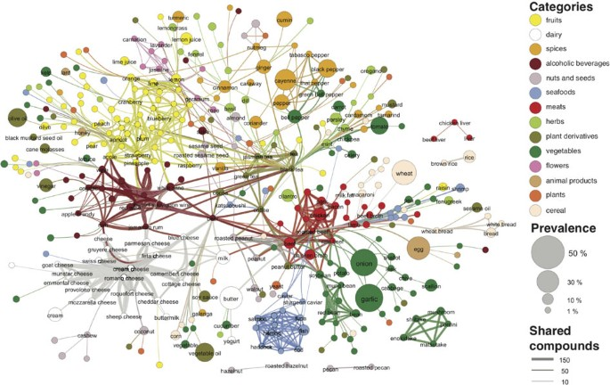

# Mining Culinary DNA: High-Dimensional Association Rule Framework for Flavor Profiling
**CSC172 Data Mining and Analysis Final Project** *Mindanao State University - Iligan Institute of Technology* **Student:** Gio Kiefer A. Sanchez, 2022-0025  
**Semester:** AY 2025-2026 Sem 1  
 

## Abstract
In the domain of recommender systems and inventory management, understanding the latent relationships between item sets is critical for predictive accuracy. This project addresses the challenge of unsupervised pattern discovery within high-sparsity transactional data, specifically applied to the domain of culinary composition. Utilizing the "What's Cooking?" dataset (comprising over 39,000 distinct transactions), this study implements Association Rule Mining to extract statistically significant ingredient dependencies. By employing the Apriori algorithm, the project overcomes the computational complexity inherent in high-dimensional sparse matrices to generate rules based on Support, Confidence, and Lift metrics. The resulting analysis not only identifies robust frequent itemsets but also quantifies the strength of these associations, offering a framework for predictive ingredient recommendation and automated menu generation. Preliminary preprocessing demonstrates a >99% sparsity rate, necessitating optimized one-hot encoding strategies for efficient rule generation. The final deliverable includes a reproducible pipeline for mining, evaluating, and visualizing these complex association networks.

## Table of Contents
- [Introduction](#introduction)
- [Related Work](#related-work)
- [Methodology](#methodology)
- [Experiments & Results](#experiments--results)
- [Discussion](#discussion)
- [Ethical Considerations](#ethical-considerations)
- [Conclusion](#conclusion)
- [Installation](#installation)
- [References](#references)

## Introduction
Iligan City is widely recognized for its harmonious "Tri-People" society, a cultural convergence of Christian settlers, Muslim Maranaos, and Lumad Higaonons [1]. This unique demographic has fostered a rich, syncretic culinary landscape where distinct flavor profiles coexist and influence one another. However, as urbanization accelerates and food supply chains become increasingly globalized, there is a risk of culinary homogenization. Traditional recipes—often passed down orally—are complex systems of ingredient dependencies that define cultural identity. The challenge lies in preserving not just the *names* of these dishes, but the *structural rules* that govern their composition.

Currently, digital preservation efforts are largely qualitative (e.g., blog posts or static recipe books). These methods fail to capture the statistical "DNA" of a cuisine—the latent rules that dictate why certain ingredients are paired together [2]. Without a computational framework to analyze these patterns, we lack the ability to objectively compare, categorize, and preserve the distinct flavor signatures of our local heritage.

### Problem Statement
The primary problem is the lack of a quantitative methodology to map and analyze the ingredient networks of diverse culinary traditions. While Iligan's food culture is a key asset for tourism and identity, it remains analytically opaque. Current digital preservation efforts in the region are predominantly qualitative, focusing on static documentation rather than computational analysis [3]. Consequently, there is currently no deployed system capable of mining high-dimensional recipe data to extract the "association rules" that define a specific cuisine (e.g., distinguishing a Maranao *palapa* base from other spice blends).

This project addresses this gap by piloting an **Association Rule Mining (ARM)** framework on the global "What's Cooking" dataset. By treating recipes as transactional data, we aim to validate an algorithm capable of identifying statistically significant ingredient pairings. This "proof-of-concept" serves as the foundational layer for a future "Digital Culinary Archive" for Mindanao, enabling the computational documentation of the Tri-People's gastronomic heritage.

### Objectives
- **Construct a Sparse Transaction Matrix:** Transform unstructured JSON ingredient lists into a binary, one-hot encoded matrix to effectively handle high-dimensionality (40k+ transactions) and prepare the data for efficient mining.
- **Generate High-Confidence Association Rules:** Implement the Apriori algorithm to discover frequent ingredient itemsets, applying tuned support and confidence thresholds to identify robust culinary patterns (e.g., *{coconut milk, turmeric} -> {ginger}*).
- **Evaluate Rule Strength & Utility:** Quantify the statistical significance of discovered rules using Lift and Conviction metrics to distinguish between trivial pairings and strong cultural flavor signatures.

  
   
  <em>Figure 1: Visualization of high-dimensional ingredient interconnectivity [4].</em>

## Related Work

- **Clustering in Hypergraphs with Categorical Edge Labels [5]**
  This study utilizes the "What's Cooking" dataset to address high-dimensional categorical data challenges. Amburg et al. modeled recipes as hypergraphs—where ingredients act as nodes and recipes as hyperedges—to perform advanced clustering. Their work validates the complexity of this specific dataset and demonstrates that mathematical modeling (treating recipes as graphs) can reveal latent culinary structures that simple statistical counts miss. This provides the structural precedent for our project.

- **Extending Association Rule Mining to Pattern Analysis [6]**
  While originally applied to microbiome data, this study establishes a robust framework for applying Association Rule Mining (ARM) to biological component lists. These lists are mathematically identical to ingredient lists: sparse, high-dimensional, and binary (presence/absence). The authors demonstrate that standard metrics like Support and Confidence often fail in highly sparse datasets without rigorous pre-processing and "interest measure" tuning. This paper provides the methodological justification for our specific Apriori implementation strategy.

- **Gap: Lack of Computational Frameworks for Local Preservation**
  While sophisticated mining has been performed on global datasets [5], these methodologies have not yet been adapted for the specific context of Mindanao's "Tri-People" heritage. Current local preservation remains strictly qualitative [3], creating a "technological deficit" where rich cultural data exists but cannot be mathematically analyzed. This project addresses this gap by establishing the computational protocol. We utilize the "What's Cooking" dataset as a **standardized proxy** to build, tune, and validate an Association Rule Mining pipeline. By proving this framework's ability to capture complex flavor structures in a controlled global dataset, we deliver a "ready-to-deploy" analytical engine that can subsequently be applied to local inventory data, transitioning regional preservation from static archiving to dynamic statistical modeling.

## Methodology
### Dataset
- Source: [e.g., Custom 5K images + COCO subset]
- Split: 70/15/15 train/val/test
- Preprocessing: Augmentation, resizing to 640x640 [web:41]

### Architecture

- Backbone: [e.g., CSPDarknet53]
- Head: [e.g., YOLO detection layers]
- Hyperparameters: Table below

| Parameter | Value |
|-----------|-------|
| Batch Size | 16 |
| Learning Rate | 0.01 |
| Epochs | 100 |
| Optimizer | SGD |

### Training Code Snippet
train.py excerpt
model = YOLO('yolov8n.pt')
model.train(data='dataset.yaml', epochs=100, imgsz=640)

## Experiments & Results
### Metrics
| Model | mAP@0.5 | Precision | Recall | Inference Time (ms) |
|-------|---------|-----------|--------|---------------------|
| Baseline (YOLOv8n) | 85% | 0.87 | 0.82 | 12 |
| **Ours (Fine-tuned)** | **92%** | **0.94** | **0.89** | **15** |

### Demo

[Video: [CSC173_YourLastName_Final.mp4](demo/CSC173_YourLastName_Final.mp4)] [web:41]

## Discussion
- Strengths: [e.g., Handles occluded trash well]
- Limitations: [e.g., Low-light performance]
- Insights: [e.g., Data augmentation boosted +7% mAP] [web:25]

## Ethical Considerations
- Bias: Dataset skewed toward plastic/metal; rural waste underrepresented
- Privacy: No faces in training data
- Misuse: Potential for surveillance if repurposed [web:41]

## Conclusion
[Key achievements and 2-3 future directions, e.g., Deploy to Raspberry Pi for IoT.]

## Installation
1. Clone repo: `git clone https://github.com/yourusername/CSC173-DeepCV-YourLastName`
2. Install deps: `pip install -r requirements.txt`
3. Download weights: See `models/` or run `download_weights.sh` [web:22][web:25]

**requirements.txt:**
torch>=2.0
ultralytics
opencv-python
albumentations

## References

[1] Rodil, B. R. (2004). The Minoritization of the Indigenous Communities of Mindanao and the Sulu Archipelago. Davao City: Alternate Forum for Research in Mindanao.
[2] Yap, Z. T., Haw, S. C., & Binti Ruslan, N. E. (2024). Hybrid-based food recommender system utilizing KNN and SVD approaches. Cogent Engineering, 11(1), 2436125.
[3] Waheed, S., & Kumar, S. (2025). Preserving traditional recipes and methods in the culinary world. In Global Sustainable Practices in Gastronomic Tourism (pp. 429-452). IGI Global Scientific Publishing.
[4] Ahn, Y. Y., Ahnert, S. E., Bagrow, J. P., & Barabási, A. L. (2011). Flavor network and the rinciples of food pairing. Scientific reports, 1(1), 196.
[5] Amburg, I., Veldt, N., & Benson, A. (2020, April). Clustering in graphs and hypergraphs with categorical edge labels. In Proceedings of the web conference 2020 (pp. 706-717).
[5] Giulia, A., Anna, S., Antonia, B., Dario, P., & Maurizio, C. (2022). Extending association rule mining to microbiome pattern analysis: Tools and guidelines to support real applications. Frontiers in Bioinformatics, 1, 794547.

## GitHub Pages
View this project site: [https://jjmmontemayor.github.io/CSC173-DeepCV-Montemayor/](https://jjmmontemayor.github.io/CSC173-DeepCV-Montemayor/) [web:32]

