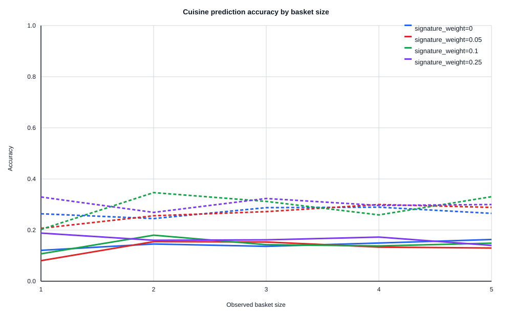

# Cuisine-CARM

Cuisine-CARM is a rule-based cuisine identifier built from the Kaggle "What's Cooking?" dataset. It takes a list of ingredients, normalizes them against the existing ingredient map, and predicts the most likely cuisine from association rules mined on a balanced recipe set.

The project keeps the original LLM-assisted ingredient normalization step from preprocessing. That work is preserved in `data/processed/ingredients.json` and reused as-is. The current pipeline starts after normalization.

## Why this matters

Ingredient lists contain enough structure to distinguish cuisines when the rules are mined carefully. A generic ingredient-based model is useful for:

- cuisine tagging in recipe search
- ingredient-aware recommendation
- lightweight culinary analysis without training a classifier

The goal here is not to replace a full predictive model. It is to show that a transparent rule system can recover useful culinary structure from sparse transactional data.

## Method

1. Start from `data/processed/prepared_recipes_cleaned_balanced.csv`, which was created after cluster-based stratified undersampling.
2. Keep the balanced class distribution instead of mining on the original imbalanced set.
3. Remove `twist` and `filling` before mining. They appear in 2,802 recipes and 2,921 ingredient occurrences, which makes them likely data artifacts rather than meaningful culinary signals.
4. Mine frequent itemsets with Apriori and export rules with:
   - support >= 1%
   - confidence >= 30%
   - lift >= 1.2
5. Use the mined rules for three rule families:
   - ingredient -> ingredient
   - ingredient -> cuisine
   - cuisine -> ingredient

The miner defaults to itemsets up to size 3. At this support threshold, size 5 is usually too sparse to justify the extra candidate churn. It is possible in principle, but it is not the best default for this dataset.

## Repository layout

```text
data/
  raw/        original Kaggle source data
  processed/  normalized and balanced recipe tables, ingredients.json
  mined/      regenerated association rules
demo/         interactive cuisine prediction script
notebooks/    original exploratory notebooks
results/      figures from the project
src/          reproducible mining script
```

## Results

The balanced dataset has 9,340 recipes. After filtering artifact ingredients, no recipe was removed.

| Metric | Value |
| --- | ---: |
| Rules mined | 533 |
| Ingredient -> ingredient | 468 |
| Ingredient -> cuisine | 20 |
| Cuisine -> ingredient | 45 |

Representative rules from `data/mined/association_rules.csv`:

| Rule | Confidence | Lift |
| --- | ---: | ---: |
| `lentil, sugar -> cuisine:indian` | 0.745 | 14.91 |
| `cuisine:indian -> sugar` | 0.711 | 1.39 |
| `chocolate, pisco -> sugar` | 0.916 | 1.80 |

## Analysis

The repository includes `src/analyze_strategy_variants.py`, which sweeps basket sizes from 1 to 5 and compares signature-rule weights on the balanced dataset. The sampled run writes:

- `results/analysis/strategy_summary.csv`
- `results/analysis/basket_size_accuracy.svg`

The sweep showed a consistent tradeoff: coverage rises as the observed basket gets larger, but signature-heavy scoring was not a stable improvement across basket sizes. The explorer therefore ranks cuisines from ingredient -> cuisine rules and uses cuisine -> ingredient rules only as supporting evidence.



## Demo

`explore.py` launches the interactive explorer, and `demo/cuisine_identifier.py` still works as a CLI or callable module. The interaction flow:

1. splits a comma-separated ingredient list
2. normalizes and fuzzy-matches each token against `ingredients.json`
3. converts matched tokens to canonical ingredient names
4. scores cuisines from matching ingredient -> cuisine rules and cuisine -> ingredient signature rules
5. returns the top cuisines with confidence scores, then shows the full ranked tail so low-confidence cuisines still appear

Commands in the interactive explorer:

- `suggest [name]`
- `undo`
- `clear`
- `done`, `quit`, or `exit`

The scoring step is data-driven. It uses the mined rule support, confidence, and lift values, then normalizes the matched evidence across cuisines. It does not rely on hand-built ingredient arrays.

Example:

```bash
python demo/cuisine_identifier.py --ingredients "lentil, sugar, garlic"
```

Example output:

```text
Normalized ingredients:
garlic, lentil, sugar
Predicted cuisines:
- indian: 1.000 from 2 matched rule(s)
  evidence: lentil -> cuisine:indian
```

## Rebuild the rules

```bash
python src/mine_association_rules.py
```

This regenerates `data/mined/association_rules.csv` and writes a filtered copy of the balanced dataset to `data/processed/prepared_recipes_cleaned_balanced_filtered.csv`.

## Notes

- The notebooks remain for traceability, but the scripts are the runnable entry points.
- The balanced dataset and stored ingredient map keep the pipeline reproducible.
- The demo uses fuzzy matching as a fallback, so close input variants still map to canonical ingredients.
